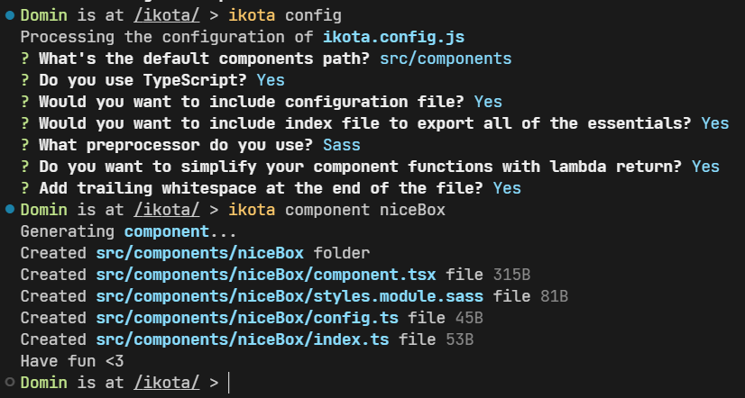

<p align="center">
  
</p>

# Overview

Ikota (Russian word for "hiccups", pronounced `/ikóta/`) is a CLI
automation tool for working with React. It offers an automated
component generator tool & more soon.

# Install

```bash
$ npm i -g ikota
$ ikota component # or
$ npx ikota component
```

# Usage

CLI offers a single command - `component` as for now.

With this command you can single-handedly generate
essentially useful component folders with:

- `index.ts/js` - Export file
- `config.ts/js` - Configuration file
- `component.tsx/jsx` - Main component file
- `styles.module.ext` - Styling file

But first of all you'd wanna initialize the configuration
file for `ikota`: `ikota.config.js`. To do that either
use the `ikota config` command or run `ikota component`
that will take you through the options that you
can provide.

> **Note**: `ikota config` will take an entire survey over
> all of the options, `ikota component` on the other hand only
> initializes essential options.

## Example



# Plugins

Plugins are the features that extend the work of ikota
component generation. With them you can use custom
preprocessors & much more. Some of the examples would be:

- [`@ikota/example`](https://github.com/Domin-MND/ikota-plugins/tree/master/example) - An example plugin implementing `Stylus` preprocessor
- [`@ikota/mantine`](https://github.com/Domin-MND/ikota-plugins/tree/master/example) - A mantine preprocessor (template) implementation for ikota.
- more soon...

## Create a plugin

If you want to make a plugin you will need to make
an NPM package for that. With the [example](https://github.com/Domin-MND/ikota-plugins/tree/master/example) plugin you can
have a quick start.

### Plugin with preprocessor

To clarify, a preprocessor in ikota isn't always a CSS
proprocessor but rather a custom template for component
and to export one you'd need to export `components` key
like this:

> Typescript
```ts
export const components = {
  ...
}
```

> CommonJS
```js
module.exports = {
  components: {
    ...
  }
}
// or
exports.components = {
  ...
}
```

Inside of the `components` object you define preprocessors
where the key name stands for its value & name and the object
of the preprocessor per se contains functions & file names for:

- index - Export file
- config - Configuration file
- component - Main component file
- style - Styling file

> **Note**: It's recommended for you to name your preprocessor
in lowercase as the `ikota config` automatically capitalizes your
name and there's no need for doing that manually. Also consider
using `kebab-case` over whitespaces.

Your average plugin would look like this:

```ts
export const components = {
  // Key name stands for preprocessor name
  'example-styl': {
    // Component file
    component: {
      // Name of the file
      // Leave the name empty if you don't want to create a file
      fileName: (config: IkotaConfig, name: string) => "...",
      // String to write file as
      function: (config: IkotaConfig, name: string) => "...",
    },
    // Styling file
    style: {
      fileName: (config: IkotaConfig, name: string) => "...",
      function: (config: IkotaConfig, name: string) => "...",
    },
    // Config file
    config: {
      fileName: (config: IkotaConfig, name: string) => "...",
      function: (config: IkotaConfig, name: string) => "...",
    },
    // Exports file
    index: {
      fileName: (config: IkotaConfig, name: string) => "...",
      function: (config: IkotaConfig, name: string) => "...",
    },
  },
};
```

> **Note**: In future updates such approach can be changed but
as for now you can use this.

# Documentation

All the available documentation regarding the usage of the CLI
is displayed in a help command:

```bash
$ ikota # or
$ ikota help
```

# Contributing

Pull requests are welcome. For major changes, please open an issue
first to discuss what you would like to change.

# License

This project is under [MIT](https://choosealicense.com/licenses/mit/)
license. You can freely use it for your own purposes.
